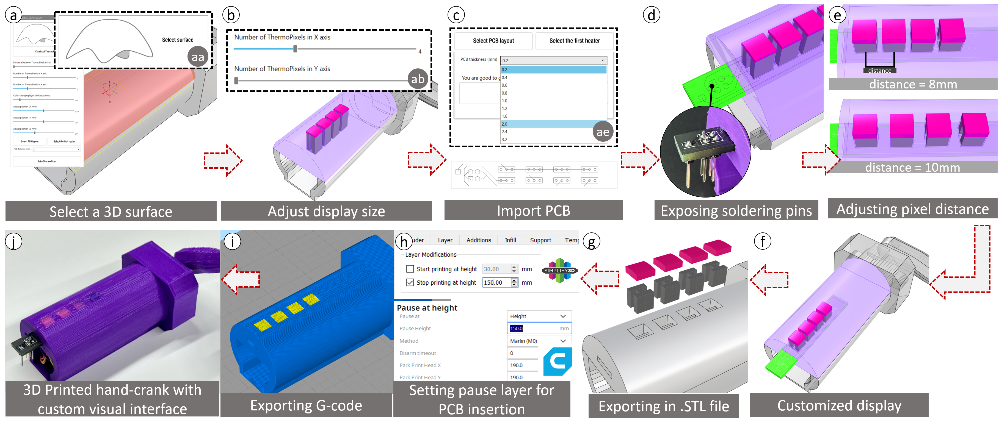

# 3D Printing Locally Activated Visual-Displays Embedded in 3D Objects via Electrically Conductive and Thermochromic Materials

This is the repository for the ThermoPixels Interface in Rhino3D

## Citation
When using or building upon this work in an academic publication, please consider citing as follows:

## Contact
For questions please contact jkpmoon@kaist.ac.kr